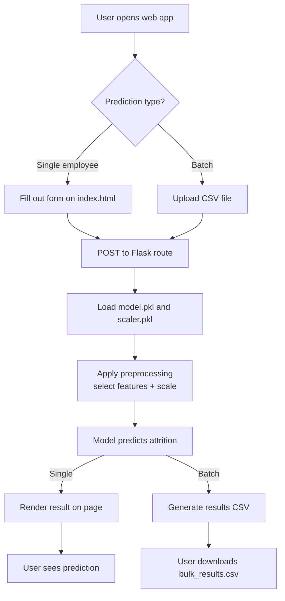

# Employee Attrition Prediction

An end-to-end machine learning web application that predicts whether an employee is likely to leave a company, built on the IBM HR Analytics Employee Attrition dataset. The app supports both single-employee predictions through a web form and batch predictions via CSV upload, exposing model results through a Flask backend with a simple browser-based interface.

## Overview

Employee attrition is costly and hard to see coming. This project trains a classification model on historical HR data to flag employees at risk of leaving, so that retention efforts can be targeted rather than reactive. The focus of the project was not just building a working model, but understanding *why* it performs the way it does. This included diagnosing and fixing a data leakage issue during development, and deliberately choosing a simple, well-generalizing model over a more complex one that overfit the data.

## Features


- **Real-time prediction:** submit a single employee's details through a web form and get an instant attrition prediction
- **Batch prediction:** upload a CSV of multiple employees and receive predictions for all of them at once
- **Downloadable reports:** batch results are exported as a CSV with attrition predictions for offline review
- **REST-style prediction endpoint:** model inference is exposed through the Flask backend, decoupled from the UI

## Tech Stack

| Layer | Technology |
|---|---|
| Backend | Flask (Python) |
| Machine Learning | scikit-learn, pandas |
| Model | Decision Tree Classifier |
| Frontend | HTML, CSS (Jinja templates) |
| Model persistence | joblib |
| Deployment | Render |

## Frontend & Backend

**Backend (Flask):** `app.py` serves as the application's core, handling routing, loading the trained model and scaler at startup, and running inference on incoming requests. It exposes routes for rendering the main page, handling single-prediction form submissions, and processing bulk CSV uploads, applying the same preprocessing pipeline used during training (feature selection, scaling) before passing data to the model. Results are returned either as a rendered prediction on the page or as a downloadable CSV for batch requests.

**Frontend (HTML/CSS + Jinja):** The interface is a Flask-rendered template (`templates/index.html`) rather than a separate single-page app. The form for entering employee details and the CSV upload control live on the same page, styled with `static/style.css`. Since Jinja templating is used, the frontend and backend are tightly coupled: form submissions POST directly to Flask routes, and the server renders the resulting prediction back into the page rather than the client fetching JSON and updating the DOM itself. This keeps the app simple and dependency-free, at the cost of the richer interactivity a JS framework would offer.

## Application Flow



## Dataset

The model is trained on the **IBM HR Analytics Employee Attrition** dataset, filtered down to nine features chosen for their interpretability and relevance to attrition:

- `Age`
- `MonthlyIncome`
- `DistanceFromHome`
- `YearsAtCompany`
- `JobSatisfaction`
- `EnvironmentSatisfaction`
- `WorkLifeBalance`
- `NumCompaniesWorked`
- `PercentSalaryHike`

The target variable, `Attrition`, is binary (`Yes`/`No`), with a real-world class imbalance of roughly 84% "No" to 16% "Yes", a factor that directly shaped the modeling approach below.

## Modeling Approach

- **Model:** `DecisionTreeClassifier` from scikit-learn, with `class_weight="balanced"` to account for the class imbalance in the target variable
- **Preprocessing:** features are standardized with `StandardScaler` before training
- **Depth selection:** rather than picking a default depth, `max_depth` was swept from 1 through unbounded to find the point of best generalization. Performance peaked at **`max_depth=2`**. Deeper trees showed clear overfitting, with recall degrading from ~43% at depth 2 down to ~17% for an unconstrained tree. This confirmed that with this feature set, a shallow, simple tree generalizes better than a deep, complex one.
- **Evaluation metric focus:** given the class imbalance, accuracy alone is a misleading metric. A model that always predicts "No" would score ~84% while being useless. Precision, recall, and F1 on the minority ("Yes") class were prioritized, with particular attention to **recall**, since failing to flag an employee who actually leaves is the costlier error for this use case.
- **Leakage check:** an earlier version of the model reported suspiciously perfect (100%) accuracy/precision/recall. This was traced back to training on a stale, pre-processed dataset rather than the true source data, and resolved by re-verifying the raw dataset's shape and class balance before retraining.

## Project Structure

```
Employee-Attrition-Prediction/
├── static/
│   └── style.css
├── templates/
│   └── index.html
├── app.py                   # Flask application and prediction routes
├── train_model.py           # Data loading, preprocessing, training, evaluation
├── Employee-Attrition.csv   # Source dataset
├── bulk_results.csv         # Example batch prediction output
├── model.pkl                # Trained Decision Tree classifier
├── scaler.pkl               # Fitted StandardScaler
├── requirements.txt
├── runtime.txt
└── README.md
```

## Getting Started

### Prerequisites

- Python 3.10+
- pip

### Installation

```bash
git clone https://github.com/TiwariDivya25/Employee-Attrition-Prediction.git
cd Employee-Attrition-Prediction
pip install -r requirements.txt
```

### Training the model

To retrain the model from scratch on the source dataset:

```bash
python train_model.py
```

This will regenerate `model.pkl` and `scaler.pkl`, and print accuracy, precision, recall, F1, and a confusion matrix for the held-out test set.

### Running the app

```bash
python app.py
```

The app will be available locally at `http://localhost:5000` (or the port specified in `app.py`).

## Usage

- **Single prediction:** fill in the employee details form on the homepage and submit to get an instant attrition prediction.
- **Batch prediction:** upload a CSV file containing the required feature columns to get predictions for multiple employees at once, downloadable as a results file.

## Model Performance

On a held-out test set (20% of the data, stratified by class):

| Metric | Score |
|---|---|
| Accuracy | ~0.70 |
| Precision (Yes) | ~0.25 |
| Recall (Yes) | ~0.43 |
| F1 (Yes) | ~0.32 |

These numbers reflect the inherent difficulty of predicting attrition from a limited feature set on an imbalanced dataset, and the deliberate choice to prioritize recall and generalization over an inflated, overfit accuracy score.

## Future Improvements

- Incorporate additional high-signal features (e.g. `OverTime`, `JobRole`, `YearsSinceLastPromotion`)
- Compare against ensemble methods (Random Forest, Gradient Boosting) for a potential precision/recall improvement
- Add automated tests for the prediction pipeline
- Experiment with SMOTE-based oversampling as an alternative to class weighting

## Author

**Divya Tiwari**
[GitHub](https://github.com/TiwariDivya25)
